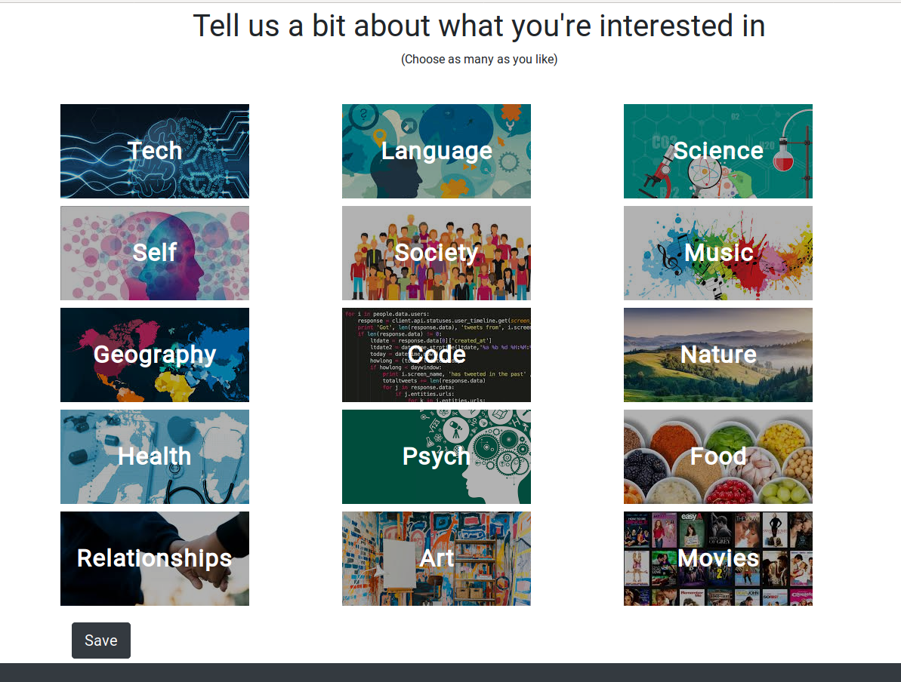

# Full-stack Quiz Creator

## Overview
This is a full-stack app that allows users to create their own quizzes and then run them.
<p align="center">
   
</p>

&nbsp;


## Third Party
Mongoose, 

Why build it?
Selecting options while clicking through various screens seemed to be a model which is quite applicable to a range of app ideas I had, and thus I decided to begin with something that seemed manageable.


## Installation 
```
npm install
npm run bla 
```


Future Development
Tests would be an initial improvement to the app. Aside from this, I would like to implement a login system and some kind of scoreboard functionality as well as stats that display average user results on quizzes,

<p align="center">
   
</p>


<p align="center">
   
</p>

<p align="center">
   
</p>


&nbsp;
## Why build it?
This is intended as a portfolio project. What began as a full-stack MERN CRUD app, eventually grew to incorporate many of the features present on Medium's own site. This is in no way an attempt to rival the site but rather is my own personal aim to develop my own skills with the MERN stack by attempting to rebuild a well-known platform.

&nbsp;
## Usage
Introduce an email into the sign up field and you will receive an email with a link (valid for a limited time) redirecting you to finish the sign up. 

&nbsp;
## More specifics
The App uses React’s Context API to pass user auth details to different components. 

It passes in props to child components using a higher order function (ContextWrapper.js) for props outside the render method, and UserConsumer for within. 

Several components also implement Hooks.

Sessions are handled with Express sessions and email authentication with JWT.

&nbsp;
## Third Party
The project users PassportJS for authenticating users and Nodemailer for both validating login details and also resetting the user’s password. 

Emails with a link are sent by way of smtp.gmail.com, API calls are done with Axios and file uploads are handled with Multer.


&nbsp;
## Live Version
You can see a live working version hosted on Heroku here:

blbal link


## Installation


```bash
cd React-Jounalling-App
npm install
npm run concurrently
```


## License
[MIT](https://choosealicense.com/licenses/mit/)
