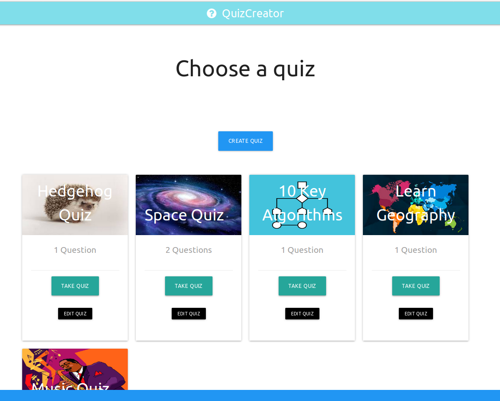
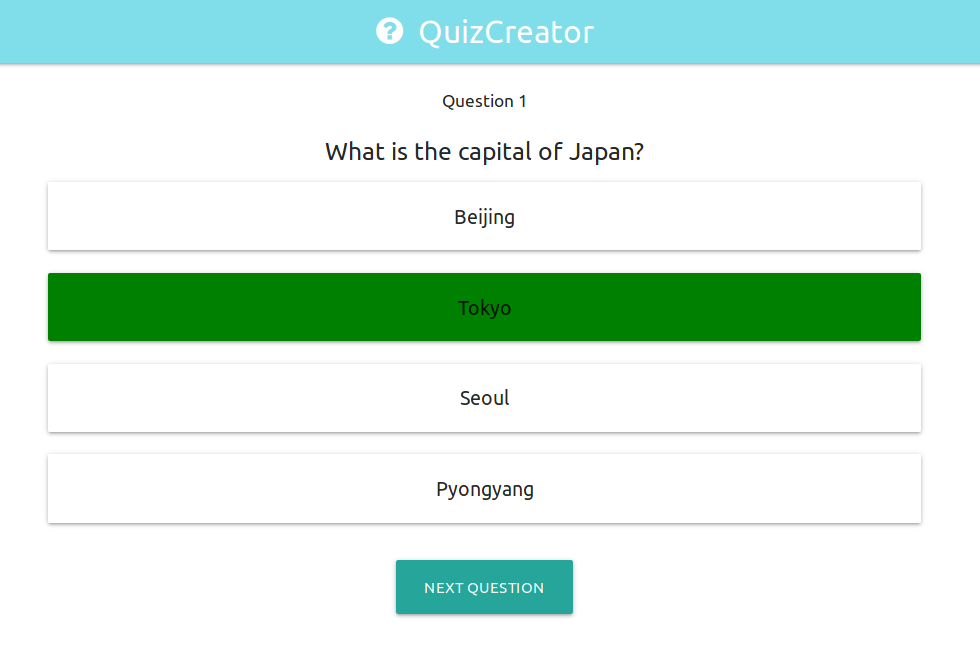
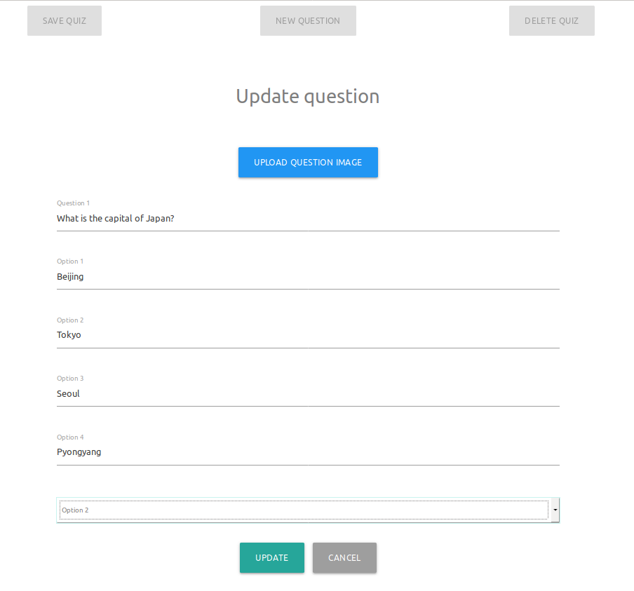

# Full-stack Quiz Creator

## Overview
This is a full-stack app that allows users to create their own quizzes and then run them.
<p align="center">
   
</p>

&nbsp;

### Why build it?
Selecting options while clicking through various screens seemed to be a model which is quite applicable to a range of app ideas I had, and thus I decided to begin with something that seemed manageable.

<p align="center">
   
</p>

### Edit Quiz


<p align="center">
   
</p>

## Third Party
The app is build upon the MERN stack, 


### Future Development
Tests would be an initial improvement to the app. Aside from this, I would like to implement a login system and some kind of scoreboard functionality as well as stats that display average user results on quizzes,


&nbsp;

## Live Version
You can see a live working version hosted on Heroku here:

blbal link


## Installation 
```bash
npm install
npm run concurrently 
```


## License
[MIT](https://choosealicense.com/licenses/mit/)
